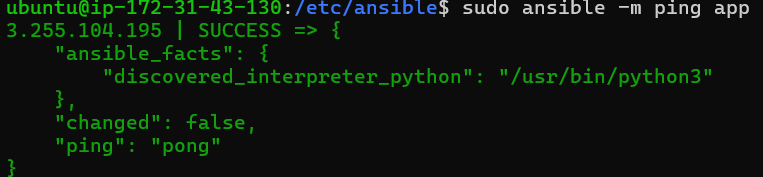
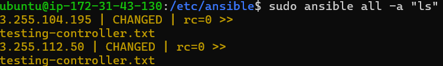

# Ansible architecture

Anisble: open source, simple (uses YAML which is human readable), powerful, agentless

2/3 instances: one for the controller (master node), others for agent node(s) 
- the controller can e.g. install nginx on all the agents, so rather than having to ssh from localhost and do it manually on each agent you can save a lot of time -> reduce time to deployment
- The agents could be e.g. EC2 instances

Hosts file contains the end points (links to agents; ips we provide). ansible controller will ping the agents and check return code 200. if 200, we can run our tests (playbooks) on the agent
- playbooks found in /etc/ansible/playbooks.yml

nsg rules: Only 22

## Setting up the architecture

1. Create 3 EC2 instances, called ansible-controller, ansible-app and ansible-db
   1. nsg rules:
   2. update and upgrade each one
2. On the controller install ansible by running:
   1. `sudo apt-get install software-properties-common`
   2. `sudo apt-add-repository ppa:ansible/ansible`
   3. `sudo apt-get update -y`
   4. `sudo apt-get install ansible -y`
   5. You can check it is installed correctly with `ansible --version` (I have `ansible 2.9.27`)
3. Ansible is found in `/etc/ansible`
   1. This should contain `hosts`, `roles` and `ansible.cfg`
4. We'd like to check the controller has access to our app and db - we can use the module ping from ansible to check:
   1. `sudo ansible -m ping app`
   2. However, we haven't provided the IP in hosts so an error will throw: `[WARNING]: provided hosts list is empty, only localhost is available. Note that the implicit localhost does not match 'all [WARNING]: Could not match supplied host pattern, ignoring: web`
   3. We can provide the public ips of the app and db in the `hosts` file (must `sudo nano`), as well as provide the name we'd like to refer to it by.
   
   4. Another error will throw if we try running ping: `[WARNING]: Could not match supplied host pattern, ignoring: web [WARNING]: No hosts matched, nothing to do`
   5. We need to `scp` our private key from localhost to the controller: `scp -i ~/.ssh/tech258.pem ~/.ssh/tech258.pem ubuntu@ip:~/.ssh/`. We should also do `sudo chmod 400 tech258.pem`
   6. With the key copied over, test the key works by sshing from the controller into the app or db by sshing like normal
   7. An error will still show: ansible is looking for the ssh key in the hosts file NOT the .ssh file. We need to link our ssh key in the hosts file:
   
   Now we can ping as normal
   
5. We can run linux commands on any agent from the controller, without ansible being installed on the agent (agentless): `sudo ansible app -a "[command]"`
   1. You can run a command on all devices with `all` e.g. `sudo ansible all -a "uname -a"
   2. To copy a file from the controller to all agents: `sudo ansible all -i hosts -m copy -a "src=/home/ubuntu/testing-controller.txt dest=/home/ubuntu/testing-controller.txt"`
   3. Check with `sudo ansible all -a "ls"`
   
6. See how ansible actually works with the `-vvv` flag: `sudo ansible all -a "ls" -vvv`
