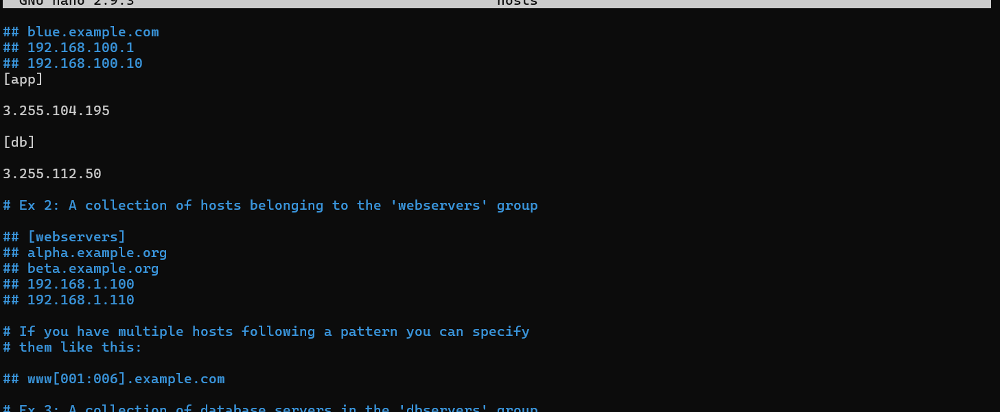
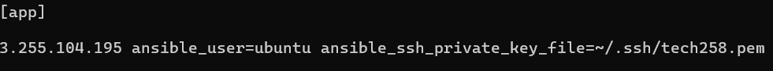
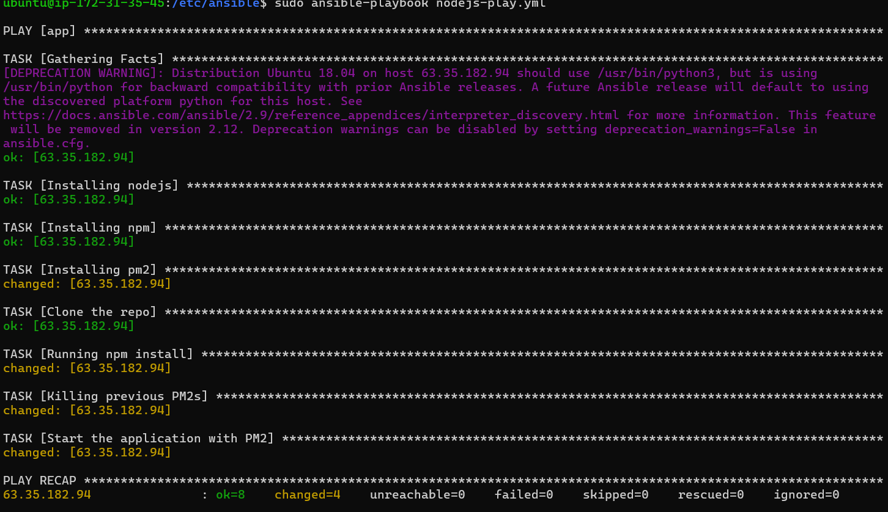
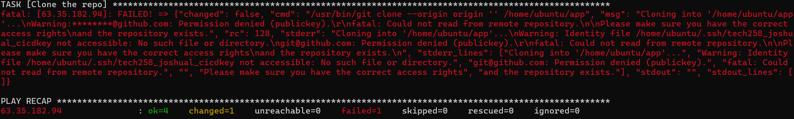

# Ansible architecture


Anisble: open source, simple (uses YAML which is human readable), powerful, agentless

2/3 instances: one for the controller (master node), others for agent node(s) 
- the controller can e.g. install nginx on all the agents, so rather than having to ssh from localhost and do it manually on each agent you can save a lot of time -> reduce time to deployment
- The agents could be e.g. EC2 instances

Hosts file contains the end points (links to agents; ips we provide). ansible controller will ping the agents and check return code 200. if 200, we can run our tests (playbooks) on the agent
- playbooks found in /etc/ansible/playbooks.yml

nsg rules: Only 22

## Setting up the architecture

1. Create 3 EC2 instances, called ansible-controller, ansible-app and ansible-db
   1. nsg rules:
   2. update and upgrade each one
2. On the controller install ansible by running:
   1. `sudo apt-get install software-properties-common`
   2. `sudo apt-add-repository ppa:ansible/ansible`
   3. `sudo apt-get update -y`
   4. `sudo apt-get install ansible -y`
   5. You can check it is installed correctly with `ansible --version` (I have `ansible 2.9.27`)
3. Ansible is found in `/etc/ansible`
   1. This should contain `hosts`, `roles` and `ansible.cfg`
4. We'd like to check the controller has access to our app and db - we can use the module ping from ansible to check:
   1. `sudo ansible -m ping app`
   2. However, we haven't provided the IP in hosts so an error will throw: `[WARNING]: provided hosts list is empty, only localhost is available. Note that the implicit localhost does not match 'all [WARNING]: Could not match supplied host pattern, ignoring: web`
   3. We can provide the public ips of the app and db in the `hosts` file (must `sudo nano`), as well as provide the name we'd like to refer to it by.
   
   4. Another error will throw if we try running ping: `[WARNING]: Could not match supplied host pattern, ignoring: web [WARNING]: No hosts matched, nothing to do`
   5. We need to `scp` our private key from localhost to the controller: `scp -i ~/.ssh/tech258.pem ~/.ssh/tech258.pem ubuntu@ip:~/.ssh/`. We should also do `sudo chmod 400 tech258.pem`
   6. With the key copied over, test the key works by sshing from the controller into the app or db by sshing like normal
   7. An error will still show: ansible is looking for the ssh key in the hosts file NOT the .ssh file. We need to link our ssh key in the hosts file:
   
```
[app]

63.35.182.94 ansible_user=ubuntu ansible_ssh_private_key_file=~/.ssh/tech258.pem

[db]

52.16.45.148 ansible_user=ubuntu ansible_ssh_private_key_file=~/.ssh/tech258.pem
```
   Now we can ping as normal
   
5. We can run linux commands on any agent from the controller, without ansible being installed on the agent (agentless): `sudo ansible app -a "[command]"`
   1. You can run a command on all devices with `all` e.g. `sudo ansible all -a "uname -a"
   2. To copy a file from the controller to all agents: `sudo ansible all -i hosts -m copy -a "src=/home/ubuntu/testing-controller.txt dest=/home/ubuntu/testing-controller.txt"`
   3. Check with `sudo ansible all -a "ls"`
   
6. See how ansible actually works with the `-vvv` flag: `sudo ansible all -a "ls" -vvv`

## Playbooks to install Nginx on the app from the controller

Playbooks are used to communicate with agents, and we can do things like install dependencies and deploy apps on our agents with them. Playbooks are written in YAML and so are files that end with `.yaml` or `.yml`

### YAML syntax

All YAML files start with `---` (best practise)

Comments start with '#'

Most playbooks start similarily:
```yaml
# specify which hosts to communicate with
- hosts: app
  
# gather logs
  gather_facts: yes

# use sudo on commands
  become: true
```
Notably indentation is very important. After specifying the host, use 2 spaces (DO NOT USE TAB) and so thats the code block.

Then we need to specify tasks for the playbook to complete (pretty much jobs in jenkins):

```yaml
  tasks:
  - name: Installing Nginx web server
    apt: pkg=nginx state=present
```

This installs nginx on hosts. You should name each task, as its useful to see each task run when we run the playbook

 There is a lot of specific syntax for some commands (e.g. git clone, using npm, and so on) so its important to look things up. There is a file install-app.yml which deploys our app to the app instance, which uses variables and so on.

We then run a playbook with `sudo ansible-playbook playbook.yml`



If any stage fails, it will tell you in the terminal:



## Integrating the Database

```bash
# TODO
# deleted the default mongo.conf rm -rf /etc/mongod.conf
# create mongod.conf in the controller - with required configuration
# allow 27017 from app or 0000
# restart mongodb
# enable mongodb
# create an env DB_HOST=db-ip:27017/posts*
# back to the web server restart the app/npm start
```

*Create the environment variable manually by manually sshing into the app intance and running `export DB_HOST=mongodb://private_db_ip:27017/posts`